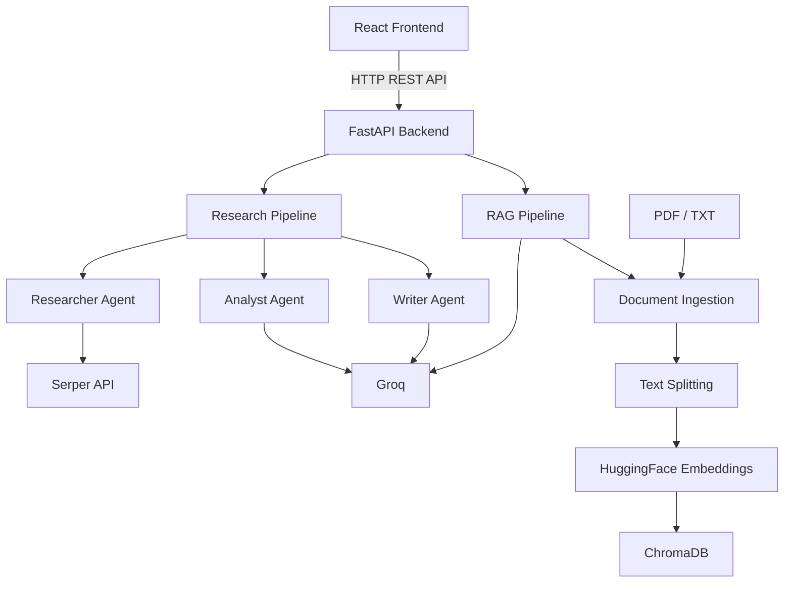
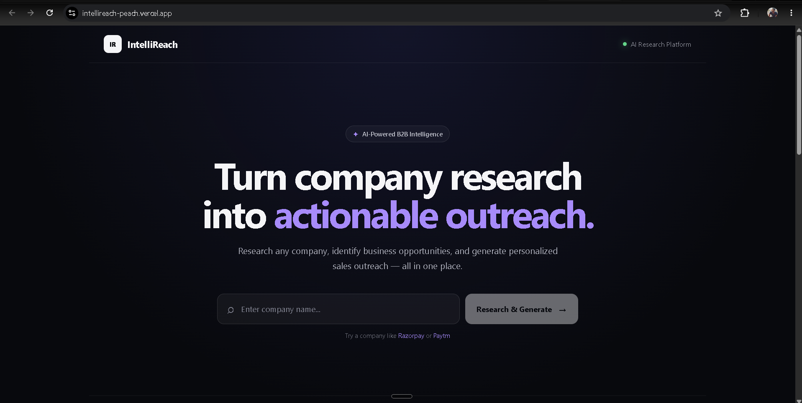
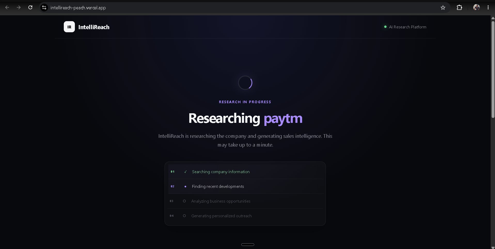
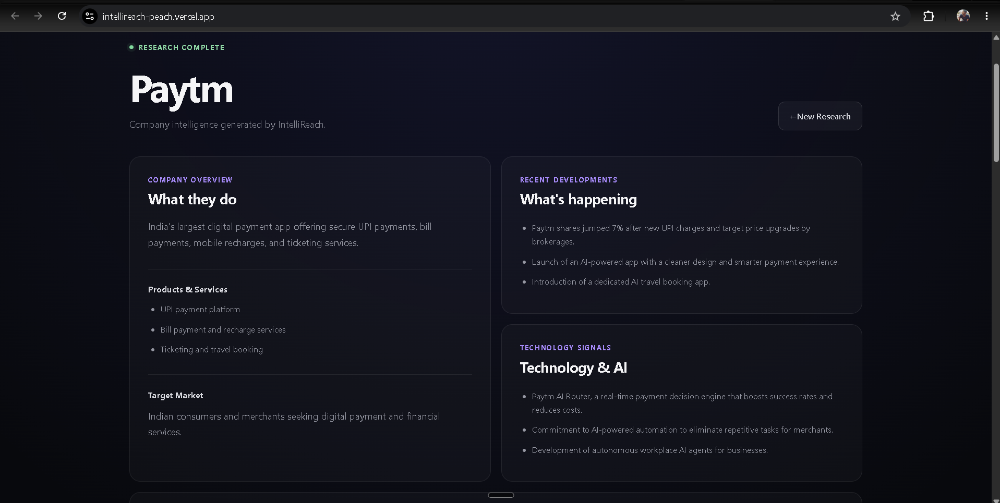
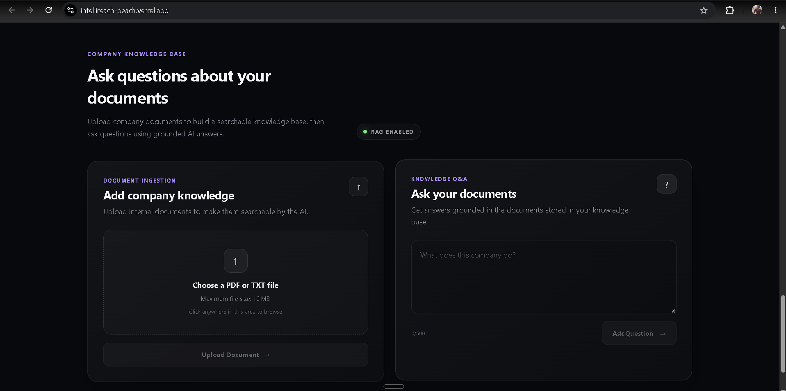

# IntelliReach

**AI-powered B2B lead research and personalized outreach platform.**

IntelliReach turns a company name into structured business intelligence,
identifies potential business opportunities, and generates personalized
sales outreach using web search and a multi-agent AI workflow.

**Live Demo:** https://intellireach-peach.vercel.app\
**GitHub:** https://github.com/kr-aditya/IntelliReach

------------------------------------------------------------------------

## Overview

Sales and business development teams often spend significant time
researching companies before writing personalized outreach.

IntelliReach automates that workflow:

1.  Enter a company name.
2.  Research the company using web search.
3.  Analyze the collected information for business pain points and
    opportunities.
4.  Generate personalized outreach and talking points.
5.  Upload company documents to a knowledge base and ask grounded
    questions using RAG.

The project combines a React frontend, FastAPI backend, CrewAI
multi-agent orchestration, Groq-powered LLMs, Serper web search, and a
ChromaDB-based RAG pipeline.

------------------------------------------------------------------------

## Features

### AI Company Research

-   Research a company from a single company-name input.
-   Collect company information, products/services, target market, and
    recent developments.
-   Uses Serper for controlled web search.

### Multi-Agent Research Workflow

The research pipeline separates responsibilities across three agents:

-   **Researcher** --- gathers and structures company information.
-   **Analyst** --- identifies business pain points, opportunities, and
    sales angles.
-   **Writer** --- creates personalized outreach and concise talking
    points.

### Personalized Outreach

-   Generates a company-specific sales email.
-   Provides concise talking points for follow-up conversations.
-   Includes a one-click copy-to-clipboard action.

### Document RAG Knowledge Base

-   Upload PDF or TXT documents.
-   Split documents into searchable chunks.
-   Generate local embeddings using
    `sentence-transformers/all-MiniLM-L6-v2`.
-   Store and retrieve document chunks using ChromaDB.
-   Ask questions using retrieved document context.
-   Return grounded answers with source information.

### API Backend

FastAPI exposes the application's research and knowledge-base
functionality through REST endpoints.

### Production Deployment

-   **Frontend:** Vercel
-   **Backend:** Railway

------------------------------------------------------------------------

## Architecture



------------------------------------------------------------------------

## How the Research Workflow Works

``` text
Company Name
     │
     ▼
FastAPI /research
     │
     ▼
Research Agent
     │
     ├── Serper web searches
     │
     ▼
Structured Company Research
     │
     ▼
Analyst Agent
     │
     ▼
Business Opportunities + Pain Points
     │
     ▼
Writer Agent
     │
     ▼
Personalized Email + Talking Points
```

The frontend displays a staged loading experience while the backend
research pipeline is running.

------------------------------------------------------------------------

## How the RAG Workflow Works

``` text
PDF / TXT Upload
      │
      ▼
Document Loader
      │
      ▼
Text Chunking
      │
      ▼
HuggingFace Embeddings
      │
      ▼
ChromaDB
      │
      ▼
Similarity Retrieval
      │
      ▼
Retrieved Context
      │
      ▼
Groq LLM
      │
      ▼
Grounded Answer + Sources
```

The RAG question-answering flow is intentionally restricted to the
uploaded knowledge base rather than using a web-search fallback.

------------------------------------------------------------------------

## Tech Stack

### Frontend

-   React
-   Vite
-   JavaScript
-   CSS
-   Fetch API

### Backend

-   Python
-   FastAPI
-   Pydantic
-   Uvicorn
-   CORS middleware

### AI / Agents

-   CrewAI
-   Groq
-   LLM-based research, analysis, and writing agents

### Search

-   Serper API

### RAG

-   LangChain
-   ChromaDB
-   HuggingFace Embeddings
-   `sentence-transformers/all-MiniLM-L6-v2`
-   PyPDFLoader
-   TextLoader
-   RecursiveCharacterTextSplitter

### Deployment

-   Railway
-   Vercel
-   GitHub

------------------------------------------------------------------------

## API Endpoints

  -----------------------------------------------------------------------
  Method                  Endpoint                Purpose
  ----------------------- ----------------------- -----------------------
  `GET`                   `/api/v1/health`        Check backend health

  `POST`                  `/api/v1/research`      Research a company and
                                                  generate outreach

  `POST`                  `/api/v1/ingest`        Upload a PDF/TXT
                                                  document to the
                                                  knowledge base

  `POST`                  `/api/v1/ask`           Ask a question using
                                                  the knowledge base
  -----------------------------------------------------------------------

Interactive API documentation is available through FastAPI's `/docs`
endpoint when running the backend.

------------------------------------------------------------------------

## Project Structure

``` text
IntelliReach/
│
├── backend/
│   ├── app/
│   │   ├── agents/
│   │   │   ├── researcher.py
│   │   │   ├── analyst.py
│   │   │   ├── writer.py
│   │   │   └── research_crew.py
│   │   │
│   │   ├── api/
│   │   │   ├── routes.py
│   │   │   └── schemas.py
│   │   │
│   │   ├── rag/
│   │   │   ├── vector_store.py
│   │   │   ├── ingestion.py
│   │   │   └── qa_service.py
│   │   │
│   │   ├── services/
│   │   │   ├── search_service.py
│   │   │   └── research_pipeline.py
│   │   │
│   │   └── config.py
│   │
│   ├── scripts/
│   │   └── reset_rag.py
│   │
│   ├── tests/
│   │   ├── test_search_service.py
│   │   ├── test_researcher.py
│   │   ├── test_analyst.py
│   │   ├── test_writer.py
│   │   ├── test_pipeline.py
│   │   ├── test_ingestion.py
│   │   └── test_rag.py
│   │
│   ├── chroma_db/
│   ├── .env.example
│   ├── .gitignore
│   ├── main.py
│   └── requirements.txt
│
├── frontend/
│   ├── public/
│   ├── src/
│   │   ├── components/
│   │   │   ├── Navbar.jsx
│   │   │   ├── Hero.jsx
│   │   │   ├── LoadingSection.jsx
│   │   │   ├── ResearchResults.jsx
│   │   │   └── KnowledgeBase.jsx
│   │   │
│   │   ├── services/
│   │   │   └── api.js
│   │   │
│   │   ├── App.jsx
│   │   ├── App.css
│   │   ├── index.css
│   │   └── main.jsx
│   │
│   ├── .env.example
│   ├── .gitignore
│   ├── index.html
│   ├── package.json
│   ├── package-lock.json
│   └── vite.config.js
│
└── README.md
```

### Files that should NOT be committed

Local/runtime files should remain ignored:

``` text
backend/.env
backend/venv/
frontend/.env
frontend/node_modules/
```

The local ChromaDB directory should also be treated as runtime/generated
data unless you intentionally want to distribute a prebuilt vector
database:

``` text
backend/chroma_db/
```

API keys and other secrets should never be placed in the README or
committed to GitHub.

------------------------------------------------------------------------

## Environment Variables

### Backend

Create `backend/.env` locally:

``` env
GROQ_API_KEY=your_groq_api_key
SERPER_API_KEY=your_serper_api_key
```

Use `backend/.env.example` as the shareable template. Never commit the
real `.env` file.

### Frontend

Create `frontend/.env` locally:

``` env
VITE_API_BASE_URL=http://127.0.0.1:8000
```

For the deployed frontend, configure the Vercel environment variable:

``` env
VITE_API_BASE_URL=https://intellireach-production.up.railway.app
```

Do not commit the real `.env` file.

------------------------------------------------------------------------

## Getting Started

### Prerequisites

Make sure you have:

-   Python 3.x
-   Node.js
-   npm
-   Git
-   A Groq API key
-   A Serper API key

### 1. Clone the repository

``` bash
git clone https://github.com/kr-aditya/IntelliReach.git
cd IntelliReach
```

### 2. Backend setup

``` bash
cd backend
```

Create and activate a virtual environment:

**Windows PowerShell**

``` powershell
python -m venv venv
.\venv\Scripts\Activate.ps1
```

Install dependencies:

``` powershell
pip install -r requirements.txt
```

Create `.env` from `.env.example` and add your API keys.

Start the API:

``` powershell
uvicorn main:app --reload
```

Backend:

``` text
http://127.0.0.1:8000
```

API documentation:

``` text
http://127.0.0.1:8000/docs
```

### 3. Frontend setup

Open another terminal:

``` powershell
cd frontend
npm install
```

Create `.env`:

``` env
VITE_API_BASE_URL=http://127.0.0.1:8000
```

Start the development server:

``` powershell
npm run dev
```

Open the local Vite URL shown in the terminal.

------------------------------------------------------------------------

## Example Workflow

### Research

``` text
Enter company name
        ↓
Research company
        ↓
Company overview
        ↓
Products & services
        ↓
Recent developments
        ↓
Pain points
        ↓
Business opportunity
        ↓
Personalized outreach
        ↓
Talking points
```

### Knowledge Base

``` text
Upload company PDF/TXT
        ↓
Document processing
        ↓
Chunking + embeddings
        ↓
ChromaDB
        ↓
Ask a question
        ↓
Similarity retrieval
        ↓
Grounded AI answer
        ↓
Sources
```

------------------------------------------------------------------------

## Deployment

### Backend --- Railway

The FastAPI backend is deployed on Railway.

Production API:

``` text
https://intellireach-production.up.railway.app
```

### Frontend --- Vercel

The React/Vite frontend is deployed on Vercel.

Live application:

``` text
https://intellireach-peach.vercel.app
```

The frontend communicates with the Railway backend through
`VITE_API_BASE_URL`.

------------------------------------------------------------------------

## Design Decisions

### Why a multi-agent workflow?

Research, analysis, and writing are separate responsibilities. Splitting
them into specialized agents makes the workflow easier to reason about,
test, and extend.

### Why Serper?

The research workflow needs current web information. Serper provides a
controlled search API that can be called by the research agent.

### Why RAG?

The knowledge-base feature should answer questions from user-provided
documents rather than relying only on the model's pretrained knowledge.
Retrieved document chunks provide the model with relevant context and
source information.

### Why ChromaDB?

ChromaDB provides local vector storage and similarity search for the
document knowledge base.

### Why FastAPI?

FastAPI provides a lightweight REST layer between the React frontend and
the AI services, while also providing automatic interactive API
documentation.

------------------------------------------------------------------------

## Current Limitations

-   Company research depends on external search and LLM APIs.
-   AI-generated research and outreach can contain inaccuracies and
    should be reviewed before real-world use.
-   The RAG knowledge base is document-based and does not use a
    web-search fallback for unanswered questions.
-   The current deployment is intended as a portfolio/demo application
    rather than a production sales platform.

------------------------------------------------------------------------

## Future Improvements

-   Persistent user/company workspaces
-   Authentication and user accounts
-   Per-company knowledge bases
-   Background job processing for long research tasks
-   Streaming research progress from the backend
-   More advanced retrieval and reranking
-   Research history and saved leads
-   Email/CRM integrations
-   Production-grade observability and monitoring

------------------------------------------------------------------------

## Screenshots

### Landing Page


### AI Research Pipeline


### Generated Company Intelligence


### Company Knowledge Base & RAG


------------------------------------------------------------------------

## License

This project is currently presented as a portfolio project.

